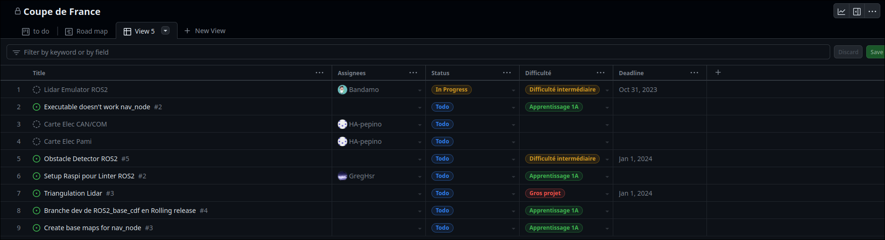
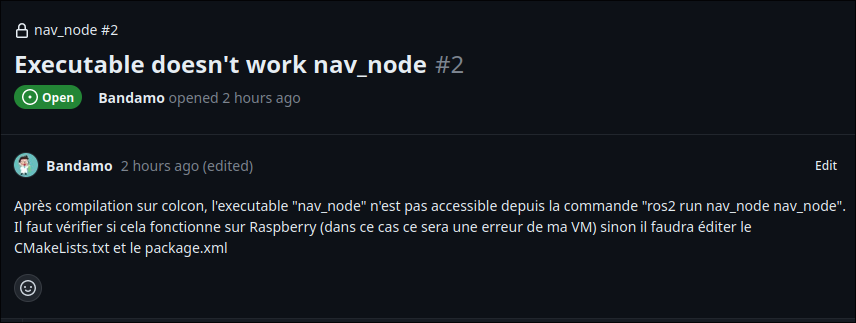
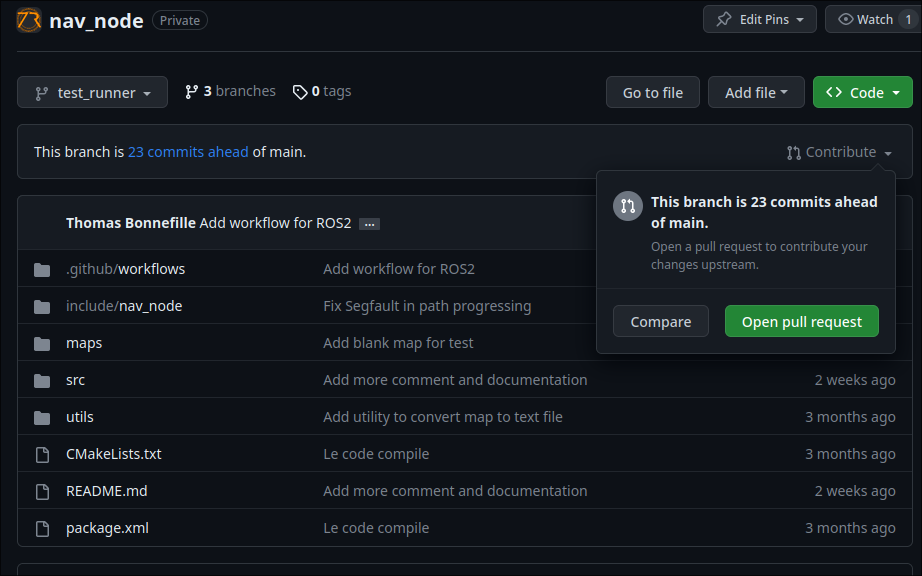

# Guide du contributeur

**Vous souhaitez contribuer à 7Robot mais vous ne savez pas par où commencer, ce guide est fait pour vous**

### Trouver un projet :

Le plus difficile pour démarrer est justement de trouver sur quoi démarrer. Depuis peu, nous avons mis en place un système de projet Github, celui-ci nous permet de noter les tâches à réaliser, leur état d'avancement ainsi que les personnes travaillant dessus.

Vous pouvez par exemple retrouver le projet de la coupe de France 2024 ici :
[https://github.com/orgs/7Robot/projects/1](https://github.com/orgs/7Robot/projects/1)

Vous verrez directement les tâches à réaliser, leur état d'avancement, la difficulté estimée ainsi que les personnes travaillant dessus.

Cliquez simplement sur une tâche pour avoir plus d'informations sur celle-ci.

### *Mais je ne comprends rien à ce message !*

Pas de panique, si le message n'est pas clair, n'hésitez pas à demander sur Discord des précisions sur la tâche. Nous sommes bienveillants et nous ne mordons pas ;-).

### *J'ai trouvé une tâche qui m'intéresse, comment je fais ?*

On rentre dans le vif du sujet, notez vous comme assigné à la tâche sur Github. 
Nous allons maintenant devoir réaliser la tâche. Attention une connaissance de Git est nécessaire pour la suite, il vous sera très facile de trouver un tutoriel sur internet ou de venir au club pour une formation personnalisée.

### Établir son espace de travail :

Vous voyez ici que la tache sélectionnée est liée au repository "nav_node", il faut donc le récupérer sur votre ordinateur.

Vous pouvez soit utiliser une interface graphique soit taper la ligne de commande suivante :
    
    `git clone https://github.com/7Robot/[repository].git`

Créez ensuite une branche pour votre tâche :

    `git checkout -b [nom de la branche]`

### *Je suis prêt à coder !*

Vous pouvez maintenant coder votre tâche, n'oubliez pas de faire des commits réguliers pour que l'on puisse suivre votre travail.

### *J'ai fini de coder, comment je fais pour que mon code soit intégré ?*

Une fois que vous avez fini de coder, il faut envoyer votre travail sur Github. Pour cela, il faut d'abord envoyer votre branche sur Github :

    `git push origin [nom de votre branche de travail]`

Ensuite, il faut créer une pull request sur Github. Pour cela, rendez-vous sur la page du repository, puis sur votre branche et ouvrez une nouvelle pull request.

Il ne vous reste plus qu'à attendre que votre pull request soit validée par un membre de l'équipe.

En attendant, retournez à l'étape 1 et trouvez une nouvelle tâche à réaliser :-).

